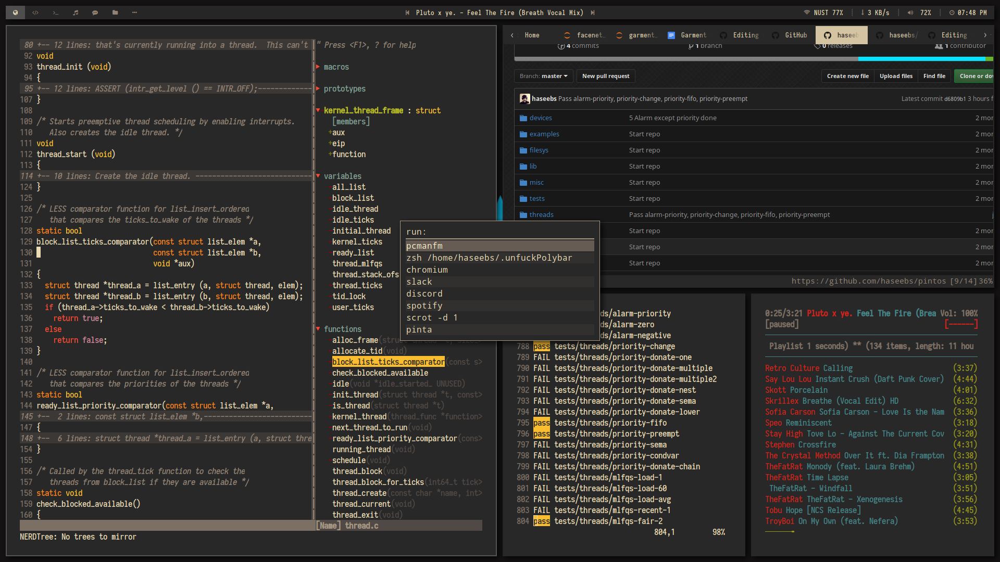

# Dotfiles for my Arch Linux Setup
This is the workspace that I use based on gruvbox theme and uses bspwm as WM. It contains large portions of other people's work with some modifications of my own. This config has been tested to be working properly on Arch Linux and Manjaro. However, it may work on other distributions too with some slight modifications.

## Screenshot

<p align="center">
  Showing urxvt, vim, rofi, firefox, ncmpcpp, polybar
</p>

## Replication
(Thanks to @jaagr)
```bash
alias dots='git --git-dir=$HOME/.dots.git/ --work-tree=$HOME'
git clone --recursive --separate-git-dir=$HOME/.dots.git https://github.com/haseebs/dotfiles.git /tmp/dots
rsync -rvl --exclude ".git" /tmp/dots/ $HOME/
rm -r /tmp/dots
dots submodule update --init --recursive $HOME/
```

